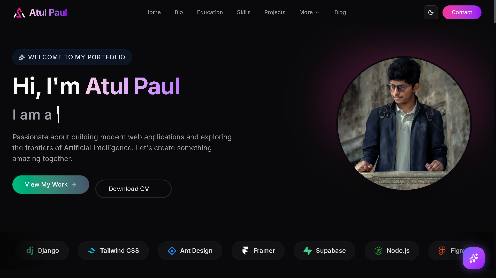

  
  
  

   

  

    A high-performance, SEO-optimized personal portfolio featuring a custom-built Content Management System (CMS), seamless authentication, and an intelligent UI.
  

  

    
  

---

## 🔒 Why is this repository private?
> **Note:** The actual source code of this portfolio project is kept **Private**. It contains proprietary admin logic, sensitive database rules (Supabase RLS), API configurations, and automated file-handling systems that are strictly meant for personal production use.

This repository serves as a **Project Showcase** to demonstrate the architecture, features, and technologies built into the platform.

---

## ✨ Key Features & Highlights

This is not just a static template; it is a full-fledged web application built from scratch with modern web standards.

* 📝 **Custom Blog CMS:** A fully secure, role-based admin panel to manage, create, edit, and delete blog posts dynamically.
* 🔐 **Authentication System:** Secure user login and signup functionality powered by Supabase Auth.
* 🔔 **Premium Interactive UI:** Clean and modern design. All default browser alerts have been completely replaced with highly interactive **Tailwind Custom Modals** and **Toast Notifications** for a superior user experience.
* 🗑️ **Smart Storage Management:** Integrated automated scripts that actively scan and delete unused images/assets from Supabase Storage when a post is removed, keeping the bucket clean.
* 🌓 **Dark/Light Mode:** Seamless theme toggling with Framer Motion page transitions.
* 🤖 **AI Integration:** An integrated ChatBot to assist visitors in real-time.
* 📈 **Advanced Analytics & SEO:** Built-in Open Graph (OG) dynamic images, optimized sitemaps, and perfect Lighthouse performance scores.

---

## 💻 Tech Stack & Tools

  
  
  
  
  
  

---

## 📸 Screenshots

---

## 📫 Developer

Built by **Atul Paul**. 
* 🌐 **Portfolio:** [atulpaul.vercel.app](https://atulpaul.vercel.app)
